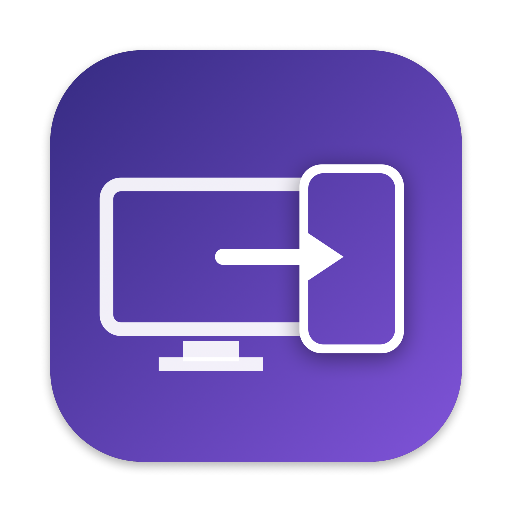

<div align="center">



# OpenSidecar

**Use your iPhone or iPad as a second monitor for your Mac — free, open source, no subscription.**

A self-hosted alternative to Apple Sidecar, Duet Display, and Luna Display.
True extended display (not just mirroring), Retina-sharp, over USB or WiFi,
with touch and scroll input.

[Website](https://peetzweg.github.io/opensidecar/) · [Quick start](#quick-start) · [How it works](#how-it-works) · [FAQ](#faq) · [Contributing](#contributing)

</div>

---

## Why OpenSidecar exists

Turning an iPhone or iPad into an external display for a Mac is a solved
problem — but every existing option has a catch:

- **Apple Sidecar** is free but requires both devices on the *same Apple ID*,
  doesn't support iPhones at all, and only works on supported hardware pairs.
- **Duet Display** moved to a subscription.
- **Luna Display** requires a hardware dongle.

OpenSidecar is the missing option: a **free, open-source, no-account,
no-dongle** way to use the iOS device you already own as a true second
display. If you were about to write your own — don't! Contribute here
instead; the hard parts (virtual display creation, low-latency H.264
pipeline, USB transport, input injection) are already working.

## Features

- 🖥️ **True display extension** — macOS treats the device as a real second
  monitor (drag windows to it, arrange it in System Settings), not a mirror.
  Mirroring is also available as a mode.
- 🔌 **USB-wired for lowest latency** — streams over the Lightning/USB-C
  cable via `usbmux`; no network required, no WiFi jitter.
- 📶 **WiFi with zero config** — the iPhone advertises itself via Bonjour;
  pick it from a dropdown on the Mac.
- 🔍 **Retina / HiDPI** — the virtual display matches the device panel
  pixel-for-pixel (@2x), so text is sharp.
- 👆 **Touch input** — tap to click, drag to drag, two-finger pan to scroll.
  Your iPhone becomes a small touchscreen for macOS.
- 🔄 **Portrait or landscape** — rotate the device and the virtual display
  rebuilds itself as a vertical monitor at native resolution.
- ⚡ **Low-latency pipeline** — hardware H.264 encode (VideoToolbox,
  real-time mode, no B-frames), TCP_NODELAY, frame-drop backpressure with
  keyframe recovery, decode-and-render via `AVSampleBufferDisplayLayer`.
- 🔒 **Self-hosted & private** — your screen never touches anyone's server.
  Two small apps, one TCP connection, that's it.

## How it works

```
MAC (sender)                                      iPHONE / iPAD (receiver)
CGVirtualDisplay  ← macOS believes a monitor is attached
   → ScreenCaptureKit (capture the virtual display)
   → VideoToolbox H.264 (hardware, real-time)
   → TCP  [4-byte length][Annex B frame]  ═══════→  NWListener :9000
                                                      → AVSampleBufferDisplayLayer
   ← JSON control messages (hello, touch, scroll) ═══
   → CGEvent injection (click / drag / scroll)
```

The **phone listens and the Mac connects** — that ordering is what makes the
exact same code work over USB (via `usbmux`/`iproxy`) and WiFi. The phone
announces its native panel size; the Mac creates a `CGVirtualDisplay` at
exactly half that in points (@2x HiDPI) and streams the pixels back.

`CGVirtualDisplay` is a **private CoreGraphics API** (the same one used by
BetterDisplay and DeskPad) — which is precisely why this project can't ship
on the App Store and lives on GitHub instead.

## Quick start

You install **two apps**: a Mac app (captures and sends) and an iOS app
(receives and displays). Both are built from this repo with standard Apple
tooling.

### Prerequisites

```sh
brew install xcodegen libimobiledevice   # project generation + USB tunnel
```

Xcode 15+ and a free or paid Apple developer account (to sideload the iOS
app onto your device).

### Build

```sh
git clone https://github.com/peetzweg/opensidecar.git
cd opensidecar
xcodegen generate
xcodebuild -project OpenSidecar.xcodeproj -scheme OpenSidecarMac \
  -configuration Debug -derivedDataPath build build
xcodebuild -project OpenSidecar.xcodeproj -scheme OpenSidecarPhone \
  -configuration Debug -destination 'generic/platform=iOS' \
  -derivedDataPath build -allowProvisioningUpdates build
```

(Or open `OpenSidecar.xcodeproj` in Xcode and hit Run on each target.)

### Run (USB — recommended)

1. Install + open **OpenSidecar** on the iPhone (it listens on port 9000).
2. On the Mac, run `./run.sh` — starts the `iproxy` USB tunnel and the Mac
   app, which auto-connects.
3. Grant **Screen Recording** (for capture) and **Accessibility** (for touch)
   when macOS asks — one time each.
4. Drag a window onto your new display. Done.

### Run (WiFi)

Open the iPhone app, then pick **"iPhone (WiFi)"** from the Connection menu
in the Mac app. Discovery is automatic via Bonjour. USB has lower latency;
WiFi has no cable.

## FAQ

**Why do I see the purple screen-recording indicator in the menu bar?**
That's a macOS privacy indicator shown for *any* app that captures the
screen — Duet, Luna, OBS, and Zoom trigger it too. Apple Sidecar doesn't,
only because it's implemented inside the OS rather than on public capture
APIs. It cannot (and shouldn't) be hidden by an app; it's how macOS tells
you a capture is running.

**Does it support iPad?** The receiver app is universal (iPhone + iPad);
iPad is the same codebase. iPad-specific polish (Pencil, pressure) is on the
roadmap.

**Why H.264 and not HEVC/AV1?** Hardware H.264 encode/decode is universally
fast and the latency is excellent. HEVC is a planned option for better
quality-per-bit.

**Is my screen content sent anywhere?** No. One direct TCP connection
between your Mac and your device, over your cable or your LAN. No servers,
no accounts, no analytics.

**Will it break on a macOS update?** Possibly — `CGVirtualDisplay` is
private API. The same risk applies to every virtual-display product.
The capture/streaming pipeline itself uses only public APIs.

**Audio?** Out of scope for now.

## Comparison

| | OpenSidecar | Apple Sidecar | Duet Display | Luna Display |
|---|---|---|---|---|
| Price | **Free, open source** | Free | Subscription | $$$ + dongle |
| iPhone as display | ✅ | ❌ (iPad only) | ✅ | ✅ |
| Different Apple IDs | ✅ | ❌ | ✅ | ✅ |
| Wired (USB) | ✅ | ✅ | ✅ | ❌ |
| True extension | ✅ | ✅ | ✅ | ✅ |
| Touch input | ✅ | ✅ | ✅ | ✅ |
| Self-hosted / auditable | ✅ | — | ❌ | ❌ |

## Roadmap

- [ ] HEVC encoding option
- [ ] Adaptive bitrate for WiFi
- [ ] Apple Pencil + pressure (iPad)
- [ ] Multiple virtual displays
- [ ] Menu bar app mode
- [ ] Prebuilt releases (signed Mac app + AltStore/SideStore manifest)

## Contributing

Issues and PRs are very welcome — especially for the roadmap items above.
The codebase is intentionally small: ~4 Swift files per platform, no
dependencies. Read [`PROJECT_BRIEF.md`](PROJECT_BRIEF.md) for the original
architecture notes and `Mac/CGVirtualDisplayPrivate.h` for the private API
surface.

## License

[MIT](LICENSE)

---

*Keywords: iPhone second monitor Mac, iPad external display, free Sidecar
alternative, Duet Display alternative, open source screen extension macOS,
use iPhone as extra screen, virtual display Mac, USB second display.*
