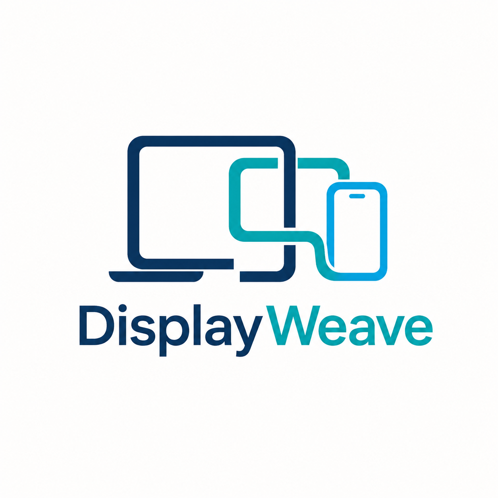

<p align="center">
  
</p>

# DisplayWeave

**One Mac. Every screen.**

[Architecture](ARCHITECTURE.md) · [Roadmap](ROADMAP.md) · [Contributing](CONTRIBUTING.md) · [Security](SECURITY.md)

Turn your iPhone, iPad, or Android device into a second display for macOS.

DisplayWeave is an open-source, local-first display extension platform built
for cross-device use. It extends the OpenDisplay foundation with an Android
receiver, Chinese localization, HEVC streaming, dynamic frame-rate
negotiation, and experimental 60/90/120fps Android display modes.

> No cloud. No account. Your display stream stays on your local connection.

## 中文说明

**一台 Mac，连接你的每一块屏幕。**

让 iPhone、iPad 和 Android 设备成为 Mac 的第二块屏幕。

DisplayWeave 是一个开源、本地优先的跨设备扩展显示项目。项目基于
OpenDisplay 演化，并增加 Android 接收端、中文界面、HEVC 视频链路、
动态帧率协商及实验性 Android 60/90/120fps 高刷新支持。

> 无需云端，无需账号，显示数据保留在本地连接中。

## Features

- Use iPhone, iPad, or Android devices as a macOS second display
- Extend or mirror the Mac desktop
- Local USB and Wi-Fi support for Apple receivers
- Local Wi-Fi streaming for Android
- Android HEVC/H.265 hardware decoding with automatic H.264 fallback
- Dynamic 30/60/90/120fps Android streaming and refresh-rate negotiation
- Touch, drag, cursor, and scrolling support
- Runtime capture, encode, transport, decode, render, queue, and latency stats
- Chinese and English interfaces
- Open-source and self-hosted

## 主要功能

- 将 iPhone、iPad 或 Android 设备作为 Mac 第二屏
- 支持扩展桌面和镜像模式
- Apple 接收端支持本地 USB 与 WiFi 连接
- Android 支持局域网 WiFi 本地传输
- Android HEVC/H.265 硬件解码及 H.264 自动回退
- Android 动态 30/60/90/120fps 模式和显示刷新率协商
- 支持触摸、拖动、光标和滚动
- 提供采集、编码、传输、解码、渲染、队列和延迟统计
- 支持中文和英文界面
- 免费、开源、本地运行

## Current Status

The Android high-refresh path has been validated on a OnePlus OPD2413 running
Android SDK 36 over Wi-Fi. In HEVC/120 mode the measured pipeline sustained
approximately 109-111 FPS across capture, encode, send, receive, decode, and
render stages, while Android reported an active 120Hz display mode. Explicit
H.264/60 fallback was also validated.

High-refresh Android support remains experimental. Requesting 120fps does not
guarantee a sustained 120 rendered frames per second on every Mac, network, or
Android decoder. USB/ADB reverse for Android and iOS/iPadOS 120Hz are planned,
not current features.

Android 高刷新链路已在 OnePlus OPD2413、Android SDK 36 和 WiFi 环境下完成
真机验证。HEVC/120 模式的采集、编码、发送、接收、解码和渲染约为
109-111 FPS，Android 实际显示模式为 120Hz；H.264/60 回退也已验证。
Android 高刷新目前仍属于实验功能，不代表所有设备都能稳定满 120 FPS。

## Requirements

- macOS 14 or later for the Mac sender
- iOS/iPadOS 17 or later for the Apple receiver
- Android 8.0 / API 26 or later for the Android receiver
- A local USB or Wi-Fi connection, depending on receiver platform
- Screen Recording and Accessibility permissions on macOS

For Android Wi-Fi mode, keep both devices on the same local network and allow
the requested local-network permissions. The current Android TCP transport is
not encrypted, so use a trusted network.

## Build From Source

Generate and build the Apple project:

```bash
./generate.sh
xcodebuild -project OpenSidecar.xcodeproj \
  -scheme OpenSidecarMac \
  -configuration Debug \
  -derivedDataPath build-run \
  -clonedSourcePackagesDirPath build-run/SourcePackages \
  build
```

Build and test the Android receiver without a system Gradle installation:

```bash
cd AndroidReceiver
./gradlew clean
./gradlew assembleDebug
./gradlew test
```

The Android Debug APK is generated at:

```text
AndroidReceiver/app/build/outputs/apk/debug/app-debug.apk
```

The original manual Android SDK-tools builder remains available at
`AndroidReceiver/scripts/build_debug_apk.sh` for compatibility and debugging.

## Repository Layout

```text
Mac/                 macOS sender, virtual display, capture, and encoder
iOS/                 iPhone and iPad receiver
AndroidReceiver/     Android receiver and standard Gradle Wrapper project
MacTests/            standalone Mac policy and compatibility self-tests
docs/                migration notes, roadmap, and acceptance documentation
project.yml          XcodeGen project definition
generate.sh          Xcode project generator
```

Useful documentation:

- [Android receiver guide](AndroidReceiver/README.md)
- [Android 120Hz migration and physical-device results](docs/120hz-migration-plan.md)
- [Development roadmap and acceptance targets](docs/roadmap-and-acceptance.md)
- [Third-party notices](THIRD_PARTY_NOTICES.md)

## Project Origin

DisplayWeave is an independent community project derived from
[OpenDisplay](https://github.com/peetzweg/opendisplay).

The project retains the applicable GPL-3.0 license requirements and
attribution. Android high-refresh, HEVC, transport, and cross-device features
are developed as extensions of the original project.

Some implementation approaches were informed by the open-source
[SideScreen](https://github.com/tranvuongquocdat/SideScreen) project. Relevant
attribution and third-party license information is documented in
[THIRD_PARTY_NOTICES.md](THIRD_PARTY_NOTICES.md).

DisplayWeave 是基于 OpenDisplay 演化形成的独立社区项目，继续遵守
GPL-3.0 许可证及相应署名要求。部分高刷新链路设计思路参考了 MIT 许可的
SideScreen 项目，详细说明见第三方声明。

## License

DisplayWeave is distributed under the [GNU General Public License v3.0](LICENSE).
